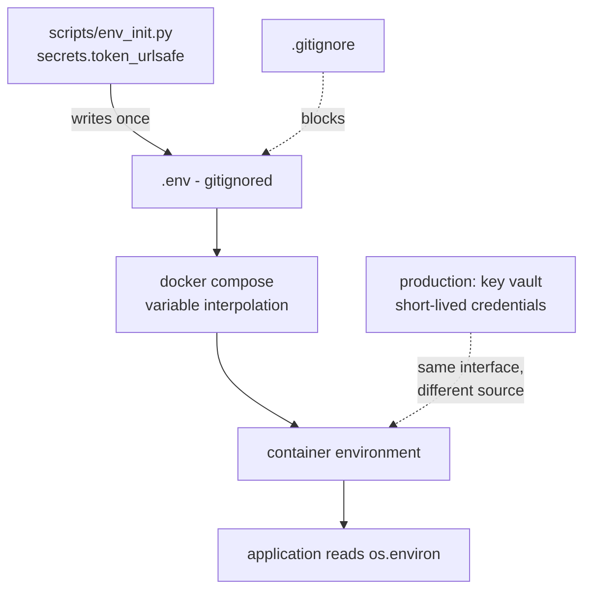

# Configuration and secrets

**One line:** keeping the things that change between environments — and especially the things that
must never be read by anyone else — outside the code that uses them.

> 🧊 **Layman box.** A hotel room is identical to every other room on the floor. What makes it *your*
> room is the key card, handed to you at check-in and deactivated when you leave. Nobody rebuilds the
> room per guest, and nobody engraves your name on the door. Configuration is the key card: the same
> build, handed different credentials depending on where it is running.

---

## The problem it solves

A database password written in a source file has four separate problems, and only the first is
obvious:

1. It is in the repository, readable by everyone with access.
2. It is in the repository's **history**, so deleting it later does not remove it — a secret that has
   been committed must be *rotated*, not deleted.
3. The same code cannot run in two places, because the value differs between them.
4. Rotating it requires a code change, a review and a deploy, so nobody rotates it.

The response is the config-in-the-environment principle from the twelve-factor guidelines: **the
build is identical everywhere, and the environment supplies what differs**. One artifact, many
configurations.

Configuration and secrets are related but not the same:

| | Configuration | Secret |
|---|---|---|
| Example | Port, log level, model name | Password, API key, encryption key |
| Committable | Yes, usually | **Never** |
| If leaked | Mildly embarrassing | Rotate immediately |
| Wants | Discoverability, defaults | Restricted access, rotation, audit |

---

## How it works

Configuration arrives as environment variables. Secrets among them come from somewhere access-
controlled — locally a gitignored file, in production a secret manager that issues short-lived
credentials.



Generating rather than inventing secrets:

```python
f"POSTGRES_PASSWORD={secrets.token_urlsafe(24)}\n"
f"LANGFUSE_ENCRYPTION_KEY={secrets.token_hex(32)}\n"
```

**"Ask the operating system's cryptographic random source for 24 bytes and write them out as text —
not a password a human chose, and not one that `random` produced."**

Two things matter here. **`secrets`, not `random`** — the `random` module is a Mersenne Twister
seeded for reproducibility, and given a modest run of its output an attacker can reconstruct its
internal state and predict the rest. It is the correct tool for simulations and catastrophic for
credentials. And **the units differ**: `token_urlsafe(24)` means 24 *bytes* of entropy rendered as
32 characters, while `token_hex(32)` means 32 bytes rendered as 64 hex characters, which is exactly
what Langfuse requires for its encryption key.

Then the part people skip:

```python
if ENV.exists():
    print(f".env already exists, leaving it alone ({ENV})")
    raise SystemExit(0)
```

**"If secrets already exist, leave them completely alone."**

This runs on every `make up`. Regenerating each time would produce a `.env` holding a new password
while the Postgres volume still holds the old one — a stack that fails to authenticate against its
own database, for reasons that look nothing like the cause.

---

## Variations and trade-offs

| Where secrets live | Strength | Weakness |
|---|---|---|
| Hardcoded in source | None | In history forever, shared by everyone |
| `.env` file, gitignored | Simple, no infrastructure | Plaintext on disk, no rotation, no audit, easy to email by accident |
| Docker or Compose secrets | Mounted as files, not visible in `docker inspect` | Still local, still static |
| Cloud key vault | Access control, audit log, rotation | Requires infrastructure and an identity to authenticate with |
| Workload identity (no stored secret) | Nothing to leak — short-lived tokens issued to the workload | Only available inside a supporting platform |

**Environment variables are convenient and imperfect.** They are readable by the whole process,
appear in `docker inspect`, and get captured by crash reporters and logging middleware that dump the
environment. Mounted secret *files* are meaningfully better on that last point, because a file is
read deliberately at a path rather than sitting in every child process's environment.

**`.env.example` vs a generator.** The common pattern is to commit an example file with blank values
and have each developer fill it in. This project generates the file instead, which removes both the
"what do I put here" step and the temptation to use `password` as the password. The trade-off is that
the generator script becomes the documentation of what variables exist — so it has to stay readable.

**Fail fast on missing config.** `${POSTGRES_PASSWORD:?message}` in Compose refuses to start without
the variable. The alternative — defaulting to something — turns a missing secret into a service
running with a guessable password, which is worse than not starting at all.

---

## Interview questions you should be able to answer

**A password was committed and then removed in the next commit. Is it safe?**
No. It is in the history, in every clone, and in every fork. Removing it from the tip changes
nothing. The only real remediation is to **rotate the credential**, and optionally rewrite history —
in that order, because rewriting history first still leaves the old value valid.

**Why `secrets` and not `random`?**
`random` is a deterministic pseudo-random generator designed for reproducibility. Observing enough
output reveals its internal state and lets an attacker predict everything it will produce. `secrets`
draws from the OS cryptographic source. Same convenience, and the failure mode of picking wrong is
silent.

**Why should the same build artifact run in every environment?**
Because if dev, staging and production are built separately, they are not the same thing, and
testing one tells you less than you think about the others. One artifact plus environment-supplied
config means what you tested is literally what ships.

**What is wrong with environment variables for secrets?**
They are process-wide, inherited by children, visible in `docker inspect` and in `/proc`, and
routinely captured wholesale by error reporters. Mounted files are narrower: read deliberately, at a
path, by the code that needs them.

**How would you rotate a secret with no downtime?**
Support two valid values at once. Add the new credential, deploy so both are accepted, move all
clients over, then retire the old one. Systems that support only one value at a time cannot be
rotated without a window — which is the actual reason so many credentials are years old.

**Why must the secret generator be idempotent?**
Because it runs on every start. If it regenerated, the new password would not match the one already
baked into the persistent database volume, and the stack would fail authentication for reasons that
look like a networking bug. Generate once, never overwrite.

---

## In this project

[`scripts/env_init.py`](../../scripts/env_init.py) generates four secrets on first run and refuses to
touch an existing `.env`. `make up` depends on it, so a fresh clone is one command from working with
no manual secret step and no default password anywhere.

`.env` is in [`.gitignore`](../../.gitignore). The Compose file uses `${POSTGRES_PASSWORD:?...}` so a
missing value stops the stack with a clear message instead of starting something half-configured.

**Honesty tier: Tier 2 — demonstrative.** The generation is done correctly with real entropy, but the
secrets sit in a plaintext file on disk with no vault, no rotation, no audit and no per-environment
separation. That is the right amount of machinery for a local stack bound to localhost, and it is
explicitly *not* what this would look like in production — where these values would come from Azure
Key Vault, ideally as short-lived credentials issued to a workload identity so there is no stored
secret to leak at all.

The interface is the same either way, which is the [interface substitution](interface-substitution.md)
idea applied to configuration: the application reads `os.environ` and does not know or care whether a
generator script or a key vault put the value there.
