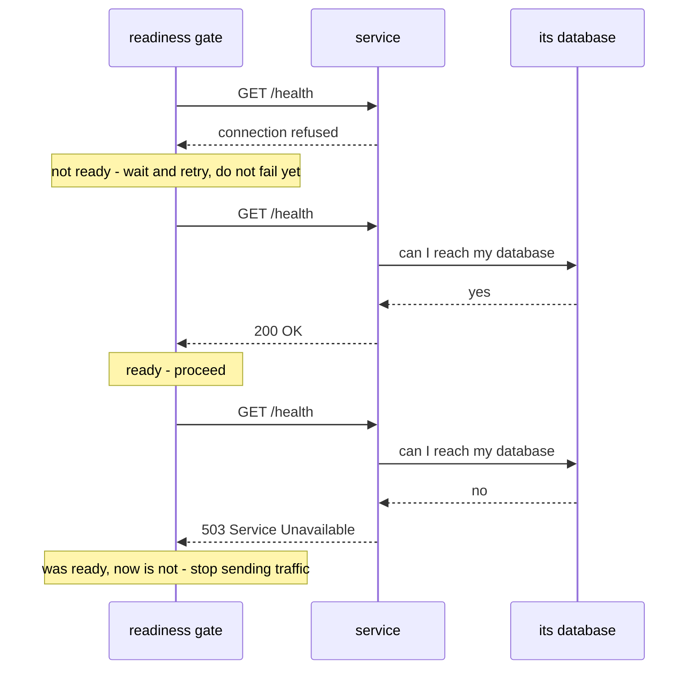

# Health checks and readiness

**One line:** the practice of asking a service whether it can actually serve a request *right now*,
rather than inferring it from the fact that its process exists.

> 🧊 **Layman box.** A shop with its lights on is not the same as a shop that is open. The staff may
> still be counting the till. "Is the building standing?" (liveness) and "can I buy something?"
> (readiness) are different questions, and only the second one tells a customer whether to walk in.
> A health check is walking up and trying the door instead of looking at the lights.

---

## The problem it solves

Every distributed system contains this bug at least once:

1. Start the database and the application together.
2. The application boots faster.
3. The application connects, fails, and crashes — or worse, starts up in a broken state.
4. Someone adds a `sleep 10` and calls it fixed.

`sleep` is a guess. It is too long on a fast machine, too short on a loaded one, and it never
notices when the thing it waited for died. A health check replaces the guess with a question, asked
repeatedly until answered.

The distinction that matters:

| Question | Name | What a failure means |
|---|---|---|
| Is the process alive? | **Liveness** | It is wedged. Restart it |
| Can it serve requests? | **Readiness** | Do not send it traffic yet. Do not restart it — it may just be warming up |
| Has slow startup finished? | **Startup** | Still booting. Do not judge it by the liveness rules yet |

Restarting a service that is merely *not ready* is a classic outage amplifier: everything restarts
forever, and nothing ever finishes warming up.

---

## How it works

A health check is just an endpoint or command that is cheap to run and honest about dependencies,
polled until it passes or a deadline expires.



The pattern in code, from this project:

```python
while True:
    still = []
    for name, where, check in pending:
        err = check()
        if err is None:
            print(f"  ok    {name:9s} {where}")
        else:
            still.append((name, where, check))
    pending = still
    if not pending or time.monotonic() >= deadline:
        break
    time.sleep(5)
```

**"Try everything that has not passed yet. Anything that passes drops off the list and is never
asked again. Keep going until the list is empty or the deadline runs out — then report, and fail if
anything is still outstanding."**

Two choices worth noticing:

- **`time.monotonic()`, not `time.time()`.** A monotonic clock only ever moves forward at a steady
  rate. Wall-clock time can jump — NTP correction, daylight saving, a user changing the clock — and
  a deadline computed from it can jump with it.
- **A deadline, not a retry count.** "Wait up to 180 seconds" is a statement about the world. "Retry
  36 times" is a statement about your loop that only accidentally describes the world.

---

## Variations and trade-offs

**Where the check runs** is the real design decision.

| Location | Sees what the client sees | Needs tools inside the image | Used here |
|---|---|---|---|
| Inside the container (Docker `HEALTHCHECK`) | No — localhost only | Yes: `curl`, `wget` or a shell | Postgres only |
| From the host / a sidecar | Yes, including networking and port mapping | No | The main gate |
| From a load balancer | Yes, plus routing | No | Not applicable locally |

An in-container check cannot detect a broken port mapping, a firewall rule, or a wrong published
port — from inside, localhost always works. A host-side check exercises the same path a real client
does. The cost is that it lives outside the container's own lifecycle, so Docker cannot act on it.

**How deep should a check go?** A check that verifies every downstream dependency will report
unhealthy whenever *anything* it touches is unhealthy, which turns one failure into a cascade of
services all marking themselves down. A check that verifies nothing returns 200 from a process that
cannot do its job. The usual resolution: liveness checks stay shallow, readiness checks verify only
the dependencies without which the service genuinely cannot serve.

**Cheap and side-effect free.** Health endpoints get polled every few seconds forever. One that runs
a real query, writes a log line, or allocates meaningfully becomes its own load problem.

---

## Interview questions you should be able to answer

**What is the difference between liveness and readiness, and why does confusing them cause outages?**
Liveness asks "is this process wedged" and failing it means *restart*. Readiness asks "can this serve
traffic now" and failing it means *route around*. Wire a slow-warming service's readiness signal into
liveness and it gets killed mid-warmup, forever — a crash loop caused entirely by the monitoring.

**Why is `sleep 30` before connecting to a database wrong?**
It is a guess with no feedback. Too short under load and you fail anyway; too long and every start is
slow; and if the database died at second 5 you still wait the full 30 before finding out. A retry
loop with a deadline gets the fast path *and* the correct failure.

**Your container is "running". What does that actually tell you?**
That PID 1 has not exited. Nothing more. It does not tell you the port is bound, the migrations
finished, the config parsed, or that a dependency is reachable. This project hit exactly that:
Compose reported success while Langfuse still had ~30 seconds of database migrations to run.

**Why check from the host rather than inside the container?**
Because that is where the client is. An in-container check cannot see a wrong port publication, a
host firewall, or a broken network mode — from inside, localhost is always fine. The host check
exercises the real path.

**Should a health check verify its downstream dependencies?**
For readiness, only the ones it truly cannot function without — and be aware you are coupling their
availability to yours. Checking everything turns a single dependency's blip into every service
simultaneously declaring itself unhealthy.

**Why does the exit code matter more than the output?**
Because automation reads exit codes. A script that prints "FAILED" in red and exits 0 will be
cheerfully ignored by `make`, by CI, and by every pipeline downstream. The gate is the non-zero exit,
not the message.

---

## In this project

[`scripts/health.py`](../../scripts/health.py) is the Phase 0.1 exit criterion, made executable. It
checks all five services — four in Docker, plus Ollama on the host, which Compose does not manage at
all — retries to a deadline, prints per-service status, and **exits non-zero if anything is still
failing**, which is what makes `make up` stop rather than lie.

It is standard library only, so it runs on a clean checkout before any virtualenv exists.

Two project-specific choices come straight from this concept. Postgres is checked with `pg_isready`
rather than a TCP connect, because Postgres binds its port before it finishes recovery — a TCP-open
test would report ready while queries still fail. And the gate lives on the host rather than in more
Compose healthchecks, partly because the Qdrant image ships without `curl` or `wget`, and mostly
because the host is where the client lives.

The gap this closes is documented, not theoretical: `docker compose up --wait` returns success for
qdrant, mlflow and langfuse the moment they are *running*, because none of those three images
declares a `HEALTHCHECK`. Only Postgres does. Verified by inspection in
[phase0.md §7](../phase0.md#7-what-was-actually-run).
