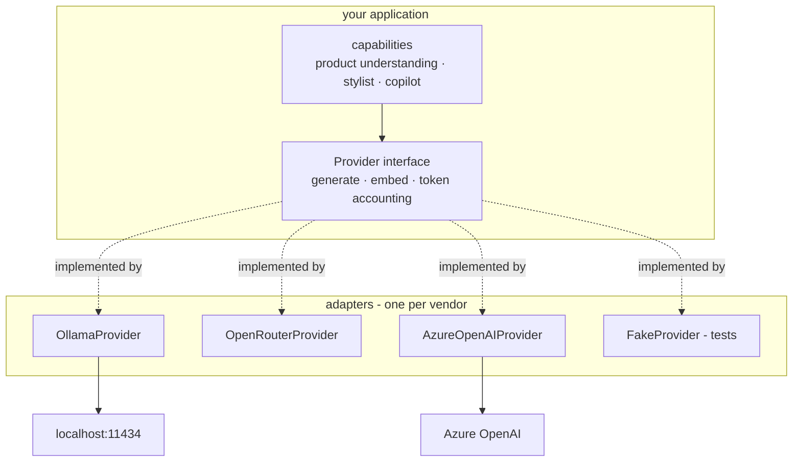

# Interface substitution (ports and adapters)

**One line:** depending on an interface you define rather than on a vendor's SDK, so the vendor
becomes a swappable detail instead of a structural commitment.

> 🧊 **Layman box.** A wall socket does not care which power station is on the other end — coal,
> nuclear, or the solar panels on your roof. The plug shape is the contract. Because everyone agreed
> on the socket, you can change the entire generating industry without rewiring a single lamp. An
> interface is the socket: your code plugs into the shape, not into the power station.

---

## The problem it solves

The natural way to use a vendor SDK is to call it from wherever you need it. Do that in fifty places
and the vendor is no longer a dependency — it is part of your architecture. Three consequences
follow:

1. **You cannot change your mind.** Switching providers means editing fifty call sites, each with its
   own error handling and its own quirks.
2. **You cannot test without it.** Every unit test either hits a real API or monkey-patches a library
   you do not own.
3. **You cannot enforce anything.** Token accounting, spend limits, retries and tracing must be
   remembered at all fifty sites. Cross-cutting concerns implemented by memory are implemented by
   nobody.

Point 3 is the one people underrate. A guarantee that depends on every future developer remembering
it is not a guarantee.

---

## How it works

Define the interface your application actually needs. Write one adapter per vendor that satisfies it.
The application depends only on the interface — so the dependency arrow points *inward*, toward your
code, instead of outward toward a vendor.



Note the direction of the dotted arrows. The adapters conform to *your* interface. You are not
conforming to theirs.

```python
class Provider(Protocol):
    def generate(self, prompt: str, *, model: str) -> Completion: ...

class Completion(NamedTuple):
    text: str
    tokens_in: int
    tokens_out: int
    model: str
    latency_ms: float
```

**"Anything that can turn a prompt into text, and can report what that cost, is a provider. Nothing
else about it matters to the rest of the system."**

Note what the return type forces. Because `Completion` carries `tokens_in`, `tokens_out` and
`model`, **every** provider must report them — so token accounting stops being a thing people
remember to do and becomes a thing the type system will not let them skip.

The special case worth knowing here: Azure OpenAI speaks the OpenAI wire protocol, and so does
Ollama. When two vendors already share a protocol, the adapter is close to empty and the swap is
genuinely a base-URL change:

```python
client = OpenAI(base_url=os.environ["LLM_BASE_URL"], api_key=os.environ["LLM_API_KEY"])
```

**"Same library, same calls — the only thing that changes between a local model and Azure is where
you point it."**

---

## Variations and trade-offs

| Approach | Cost | When it is right |
|---|---|---|
| **Call the SDK directly** | Zero abstraction, total lock-in | Genuinely one vendor forever, no cross-cutting concerns to enforce |
| **Thin interface, adapter per vendor** | One small file per vendor | You have two or more implementations, or you need a seam for tests, retries and accounting |
| **Lowest-common-denominator interface** | Loses vendor-specific features | Rarely right. Usually the reason "portable" abstractions feel useless |
| **A framework's abstraction** | Free, but it is someone else's model of the problem | When their model matches yours and you do not need to guarantee anything through the seam |

**The real cost is the lowest-common-denominator trap.** An interface built to satisfy every possible
provider ends up exposing only what they all share, and you lose the reason you picked a provider in
the first place. The way out is to design the interface from **what your application needs**, not
from the union or intersection of vendor capabilities — and to let a capability that only one vendor
has be an explicit, documented extension rather than a pretence.

**Two implementations is the honesty test.** An interface with exactly one implementation is a
guess. The second implementation is what reveals which parts of the abstraction were real and which
were just the first vendor's shape with a new name. Writing it before you claim portability is the
difference between a designed seam and a hopeful one.

---

## Interview questions you should be able to answer

**What is dependency inversion, in one sentence?**
High-level policy should not depend on low-level detail — both should depend on an abstraction owned
by the high-level side. In practice: your application defines the interface, and the vendor adapter
implements it.

**How is this different from just wrapping a library?**
A wrapper is shaped by the library and tends to mirror it method for method, so it inherits the
library's model and provides no leverage. A port is shaped by *your* application's needs, so the
adapter absorbs the impedance mismatch — and there is somewhere to put the retries, the accounting,
the caching and the tracing.

**What is the main risk of this pattern?**
The lowest-common-denominator abstraction: an interface so generic it cannot express what any
specific provider is good at. Second risk, over-abstraction — an interface with one implementation
and no prospect of a second is pure cost.

**How would you migrate from a local model to Azure OpenAI?**
Because both speak the OpenAI protocol, it is a base URL, an API key and a deployment name. If the
codebase calls the client directly in many places, that is still a large diff and a large test
surface. Behind a provider interface, it is one adapter and one config change — and the honest
version of this answer names what is *not* covered: content filtering behaviour, rate limit shapes,
and error taxonomies differ, so the adapter is where those differences get handled.

**How do you guarantee every model call is accounted for?**
Make it structurally impossible to avoid. If the only way to reach a model is through the interface,
and the interface's return type carries token counts, then accounting is not a convention anybody can
forget. Enforce the "only way" part mechanically — an import rule in CI that fails the build if a
capability imports a provider or an SDK directly.

**When would you *not* do this?**
When there is exactly one implementation, no test seam needed, and nothing cross-cutting to enforce.
An interface introduced for a hypothetical second vendor that never arrives is speculative
generality — cost paid up front for an option never exercised.

---

## In this project

This is the idea the whole project rests on. [PROJECT_BRIEF.md](../../PROJECT_BRIEF.md) §2 states the
rule: **every external dependency sits behind an interface with two implementations** — the local one
and a documented Azure one. That is what makes "Azure-shaped, locally-run" a design claim rather than
a slogan, and it is why the budget is $80 instead of a cloud bill.

| This project uses | Standing in for | Swap difficulty |
|---|---|---|
| Ollama | Azure OpenAI | Base URL — both speak the OpenAI protocol |
| Qdrant | Azure AI Search | Real: different filter and hybrid APIs behind one retrieval interface |
| MLflow | Azure ML | Low: Azure ML is MLflow-compatible at the client |
| Llama Guard 3 | Azure AI Content Safety | Different implementation, same integration point |
| Langfuse plus OpenTelemetry | Azure Monitor | OTel is the portable layer, exporters swap |

**Honesty tier: the substitution mapping is Tier 3 — showcase.** It is designed and written down, and
zero lines have been tested against real Azure. Where an Azure adapter gets written but never run
against Azure, that fact is stated rather than glossed.

Phase 0.2 builds the `Provider` interface and the Ollama adapter. Phase 0.3 adds OpenRouter and Azure
— the second and third implementations, which is where the abstraction gets tested rather than
asserted. Phase 0.6 adds the import-linter rule that makes the seam unbypassable.
