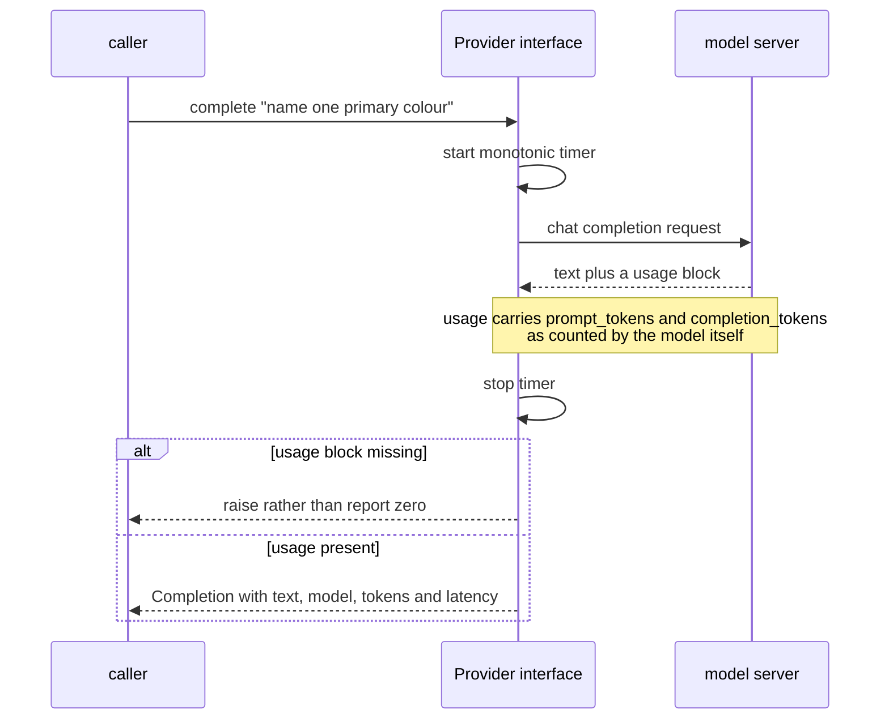

# Tokens and token accounting

**One line:** language models charge, remember and think in *tokens* — sub-word fragments — so
counting them is how you control cost, stay inside the context window, and predict latency.

> 🧊 **Layman box.** A taxi does not bill you per *journey*, it bills per unit of distance on the
> meter. Two trips to "the station" can cost wildly different amounts. Tokens are the meter: the model
> does not charge per question, it charges per fragment of text going in and coming out. If you never
> look at the meter, you find out what the ride cost only when the bill arrives.

---

## The problem it solves

Three separate limits are all denominated in tokens, and none of them are visible in your source code:

1. **Cost.** Metered providers bill per input token and per output token, usually at different rates.
2. **The context window.** A model can only attend to a fixed number of tokens. Exceed it and the
   request fails — or worse, silently truncates, and the model answers from half a conversation.
3. **Latency.** Time to first token tracks input length; total time tracks *output* length. A prompt
   that generates 800 tokens is slow no matter how fast the hardware is.

A system that does not count tokens cannot reason about any of the three. It can only react — to a
bill, to an error, to a complaint about speed.

---

## What a token actually is

Not a word, and not a character. Models split text with a **sub-word** scheme, typically byte-pair
encoding: frequent strings become single tokens, rare ones get broken into pieces.

| Text | Roughly |
|---|---|
| `cat` | 1 token |
| `unbelievable` | 3 to 4 tokens |
| `linen-blend` | 3 to 5 tokens, and the hyphen is often its own |
| `SKU-88213-XL` | 6 or more — identifiers fragment badly |
| A page of English prose | about 750 words, about 1,000 tokens |

Two consequences matter in retail. **Product codes and rare brand names are token-expensive**, because
the tokenizer has never seen them and falls back to pieces. And **every model family tokenises
differently** — the same string is not the same number of tokens to Qwen, to Llama and to GPT-4, so a
count from one is an estimate, not a measurement, for another.

---

## How it works

The provider returns the authoritative count with the response. You record it at the seam every call
already passes through, so nothing has to remember to do it.



The enforcement trick is to put the accounting in the **return type**:

```python
@dataclass(frozen=True)
class Completion:
    text: str
    model: str
    provider: str
    tokens_in: int
    tokens_out: int
    latency_ms: float
```

**"There is no way to receive a model response in this codebase that is not already accompanied by
what it cost — because this is the only type a call can return."**

Accounting that lives in a helper function everyone is supposed to call is accounting that will be
missed. Accounting in the type cannot be.

The matching rule is to **refuse to guess**:

```python
if r.usage is None:
    raise GatewayError("provider returned no usage block - refusing to report zero tokens")
```

**"If the provider will not say what this cost, fail — do not record zero."**

A zero is worse than an error, because it is indistinguishable from a real free call and quietly
corrupts every total computed from it afterwards.

---

## Variations and trade-offs

| Where the count comes from | Accuracy | Cost |
|---|---|---|
| The provider's `usage` block | Authoritative — it is what you are billed on | Only available *after* the call |
| Local tokenizer (`tiktoken`, HF tokenizers) | Exact for input, if it is the *right* tokenizer | A dependency, and it must match the model |
| `len(text) / 4` | Rough — fine for a guard rail, wrong for a ledger | Free |

**You need both directions.** The provider's count is the truth, but it arrives too late to prevent
anything. To *stay inside* a context window or a per-request budget you must estimate the input before
sending it — that is what a local tokenizer is for, and it is why context assembly is token-budgeted
rather than hopeful.

**Input and output tokens are not equally priced or equally slow.** Output is typically several times
more expensive and dramatically slower, because it is generated one token at a time while input is
processed in parallel. "Reduce tokens" is therefore not one optimisation but two, with different
levers: retrieve less versus answer shorter.

**Counting is not the same as controlling.** Recording that a request cost 4,000 tokens after the fact
is observability. Refusing to *send* the request is a budget. Both are needed, and they belong at
different points in the pipeline.

---

## Interview questions you should be able to answer

**Why do models use sub-word tokens rather than words or characters?**
Words give an unbounded vocabulary that cannot handle anything unseen; characters give sequences so
long that attention becomes impractical. Sub-word units are the compromise — a fixed vocabulary that
can still spell out anything it has not seen by falling back to smaller pieces.

**Your token bill doubled with no change in traffic. Where do you look?**
Output length first, since it is the expensive half — a prompt change or a model swap can make
responses longer. Then retrieved context size, since RAG systems grow their own input silently as the
corpus or `k` changes. Then model routing, if a cheap model started falling back to an expensive one.
The reason you can even ask the question is that every response was recorded with its counts.

**Why not estimate tokens with `len(text) / 4`?**
It is fine as a guard rail and useless as a ledger. It is wrong in the direction that hurts — product
codes, brand names and non-English text fragment far worse than prose, and those are exactly the
strings a retail system is full of. Estimate to *prevent*, record actuals to *account*.

**A provider does not return a usage block. What do you do?**
Fail, or count locally and mark the number as derived. What you never do is record zero, because zero
is indistinguishable from a genuinely free call and silently corrupts every aggregate built on it.

**How do you keep a request inside a context window?**
Budget the input before sending: count what you intend to include with a local tokenizer, and drop or
truncate by priority until it fits, logging what was dropped. Relying on the provider's error means
finding out only on failure, and relying on silent truncation means the model answers a question you
did not ask.

**Does a token count from one model transfer to another?**
No. Tokenisation is per model family. The same string is a different number of tokens to different
models, so a count taken from one is an estimate for another — which matters the moment you compare
cost across a routing decision.

---

## In this project

[`atelier/gateway/provider.py`](../../atelier/gateway/provider.py) defines `Completion`, the only type
a model call can return. It is frozen — a response is a record of something that already happened, so
nothing downstream may edit the count it is accounted against — and it validates on construction, so a
negative count or a missing model name raises rather than being stored.

[`atelier/gateway/ollama.py`](../../atelier/gateway/ollama.py) raises `GatewayError` when a response
arrives with no `usage` block, rather than defaulting to zero.

The Phase 0.2 gate ([`scripts/gate_02.py`](../../scripts/gate_02.py)) checks this literally, on every
one of its 100 calls: a response missing `tokens_in`, `tokens_out`, `model` or `latency_ms` is a gate
failure, not a warning.

What is deliberately **not** here yet: no cost in currency, because Ollama is free and pricing tables
arrive with the metered providers in Phases 0.3 and 0.4; no local tokenizer, because nothing yet needs
to estimate *before* sending — that lands with context assembly in Phase 2; and no aggregate ledger,
which is Phase 0.4's spend guard.

Related: [interface substitution](interface-substitution.md) is what makes the seam exist at all.
