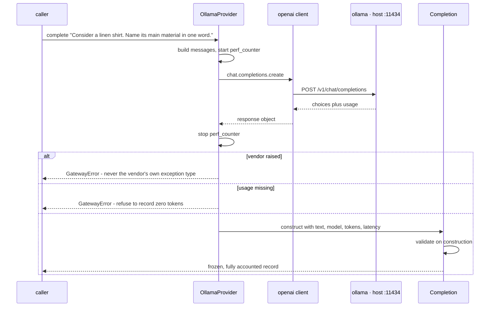

# Phase 0.2 — The provider interface: one seam every model call goes through

> **What this phase adds, in plain terms.** The first actual model call. But the deliverable is not
> "we can talk to a model" — that is ten lines and everyone has it. The deliverable is that there is
> now exactly **one door** to a model in this codebase, and nothing gets through it without being
> counted. `Completion` is the only type a model call can return, and a `Completion` cannot exist
> without its token counts, its model name and its latency. Accounting stops being something a
> developer remembers and becomes something the type system will not allow them to skip.

**Phase brief:** [PROJECT_BRIEF.md](../PROJECT_BRIEF.md) §9, Phase 0.2.
**Exit criterion:** 100 calls through the interface, 0 unhandled exceptions; every response carries
`tokens_in/out`, `model`, `latency_ms`.
**Status: met.** `100/100 complete and fully accounted, 0 failures`. Evidence in [§7](#7-what-was-actually-run).

Previous: [phase0.md](phase0.md) — Phase 0.1, the service stack.

---

## 1. Honesty up front

| Part | Tier | Why that tier, honestly |
|---|---|---|
| `Provider` interface + `Completion` | **Tier 1 — load-bearing** | This is the real abstraction the rest of the platform is built on, and it is complete for what it claims: one call shape, enforced accounting, a normalised error type |
| Enforced token accounting | **Tier 1 — load-bearing** | Not a convention. A response with no usage block raises; a `Completion` with impossible values raises. There is no code path that records a silent zero |
| `OllamaProvider` | **Tier 2 — demonstrative** | Real calls to a real local model, correct usage extraction. But no retry, no timeout policy beyond the client default, no failover, no cost — all Phase 0.3 and 0.4 |
| "One env var to Azure" | **Tier 3 — showcase** | The client is deliberately the OpenAI one so that this becomes true, but **no Azure adapter exists yet and nothing has been run against Azure**. The claim is a design intention until Phase 0.3 |
| Unbypassable seam | **not yet** | Nothing today *stops* a future capability importing `openai` directly. The import-linter contract that makes the rule real is Phase 0.6. Until then it is a convention |

That last row matters. The whole argument for this design is that the seam cannot be bypassed — and
right now it can be. It is honest to say the guarantee is half-built.

---

## 2. The end-to-end flow



**The load-bearing idea:** there are three ways out of that box and two of them are refusals. A
provider that cannot say what a call cost is treated as a failure, not as a free call.

---

## 3. Function-by-function flow, with dummy inputs and outputs

### 3.1 `atelier/gateway/provider.py::Completion`

```python
@dataclass(frozen=True)
class Completion:
    text: str
    model: str
    provider: str
    tokens_in: int
    tokens_out: int
    latency_ms: float
```

**"A model response and its bill, welded together. You cannot obtain one without the other."**

`frozen=True` because a response is a record of something that already happened — nothing downstream
should be able to edit the token count it is later accounted against.

```
# in : Completion(text="Linen.", model="qwen2.5:7b-instruct-q4_K_M", provider="ollama",
#                 tokens_in=41, tokens_out=3, latency_ms=1332.4)
# out: a valid frozen record, .tokens_total == 44

# in : same but tokens_in=-1
# out: GatewayError("negative token count: in=-1 out=3")

# in : same but model=""
# out: GatewayError("completion must name its model and provider")
```

### 3.2 `atelier/gateway/provider.py::Provider`

A `Protocol`, not a base class — so a provider is anything with the right shape and nothing has to
inherit from us. The interface is deliberately small, shaped by what this application needs rather
than by the union of what vendors offer.

### 3.3 `atelier/gateway/ollama.py::OllamaProvider.complete`

```python
started = time.perf_counter()
r = self._client.chat.completions.create(...)
latency_ms = (time.perf_counter() - started) * 1000
```

**"Time the call with a stopwatch, not a wall clock — this is a duration, and a clock adjustment
mid-call must never produce a negative latency."**

```
# in : complete("Consider a wool coat. Say which season it belongs to.", max_tokens=16)
# out: Completion(text="Winter.", model="qwen2.5:7b-instruct-q4_K_M", provider="ollama",
#                 tokens_in=44, tokens_out=3, latency_ms=1361.0)

# in : same, with ollama not running
# out: GatewayError("APIConnectionError: Connection error.")   <- normalised, not openai's type

# in : same, provider answers with no usage block
# out: GatewayError("provider returned no usage block - refusing to report zero tokens")
```

The `except Exception -> raise GatewayError` wrapper is the point of a seam: a caller in the
capabilities layer must never have to catch `openai.APIConnectionError`, because that would make the
vendor's exception taxonomy part of this codebase's public surface.

### 3.4 `scripts/gate_02.py::prompts`

```
# in : prompts(3, seed=0)
# out: ['Consider a suede boot. Name one colour it suits.',
#       'Consider a knit jumper. Give one word for its fit.',
#       'Consider a silk scarf. Give one occasion to wear it.']
```

Seeded, so a rerun is comparable, and **varied**, so 100 calls exercise 100 different prompts rather
than measuring a cache that does not exist yet.

### 3.5 `scripts/gate_02.py::missing_fields`

The exit criterion, checked literally rather than assumed.

```
# in : Completion(text="Red", model="m", provider="ollama", tokens_in=8, tokens_out=1, latency_ms=12.0)
# out: []

# in : same but tokens_out=0
# out: ["tokens_out"]        -> counted as a gate FAILURE, not a warning
```

### 3.6 `scripts/gate_02.py::run`

Distinguishes two failure classes on purpose:

```python
except GatewayError as e:   # expected failure mode, still fails the gate
except Exception as e:      # UNHANDLED - the thing the criterion actually forbids
```

**"A failure we designed for is bad. A failure we did not is worse — and the criterion is about the
second kind, so they are counted separately."**

### 3.7 `scripts/gate_02.py::self_test`

```
# in : python scripts/gate_02.py --self-test
# out: a 3-call run that PASSes, a 3-call run that FAILs, two rejected Completions,
#      "self-test ok: gate passes accounted responses, rejects unaccounted ones", exit 0
```

Same lesson as the Phase 0.1 health gate: a gate that has never been observed failing is not known to
be a gate. This one drives a stub provider that returns `tokens_out=0` and asserts the run comes back
non-zero.

---

## 4. File by file

| File | What it does | Why it exists |
|---|---|---|
| [`atelier/gateway/provider.py`](../atelier/gateway/provider.py) | `Completion`, `Provider`, `GatewayError` | The seam. Everything else in the platform depends on this and not on a vendor |
| [`atelier/gateway/ollama.py`](../atelier/gateway/ollama.py) | The local implementation, via the OpenAI-compatible endpoint | Free and unlimited inference is what makes evaluation-driven development affordable at all |
| [`atelier/gateway/__init__.py`](../atelier/gateway/__init__.py) | Re-exports | So callers write `from atelier.gateway import OllamaProvider` and never reach into a module named after a vendor |
| [`scripts/gate_02.py`](../scripts/gate_02.py) | The exit criterion, executable | A phase is done when it hits its number, so the number needs a command |
| `Makefile` | `make gate-0.2` | Same reason `make up` exists |
| `pyproject.toml` | `openai` added as the first runtime dependency | Dependencies get added by the phase that needs them, never in advance |
| `atelier.egg-info/` | **Generated, not written.** setuptools drops it in the project root during `pip install -e .` | Not source. It holds the metadata pip needs to resolve the editable install - gitignored, safe to delete, regenerated on the next install |

---

## 5. ⚠️ Scaffolded — be ready to explain

- **The seam is not yet enforced.** Nothing prevents a future module importing `openai` directly and
  bypassing all accounting. Phase 0.6's import-linter contract is what turns this from a convention
  into a guarantee, and until then the honest description is "agreed", not "enforced".
- **`max_retries=0` on the client is deliberate.** The `openai` client retries by default, which
  would silently hide exactly the failures Phase 0.3 is supposed to observe and handle. Be ready to
  explain why you would turn *off* a resilience feature in order to build resilience.
- **No cost, in currency.** `Completion` carries tokens, not dollars. Ollama is free, so a price of
  zero would be correct and useless. Pricing tables arrive with the metered providers in 0.3 to 0.4.
- **No `.env` loading.** The provider reads `OLLAMA_BASE_URL` from the real environment and otherwise
  falls back to a working default, so nothing needs `.env` parsed yet. Phase 0.3 needs
  `OPENROUTER_API_KEY`, and that is when a loader gets written or a dependency gets added.
- **`temperature=0.0` by default.** Reproducibility over variety. Note that this does *not* make
  local inference deterministic — batching and floating-point non-associativity on the GPU still move
  results between runs.
- **The model does not fully fit in VRAM.** `ollama ps` reports `18%/82% CPU/GPU` for
  `qwen2.5:7b-instruct-q4_K_M` at 4096 context on a 6 GB RTX 2060. It works, and it is slower than a
  fully resident model. See the throughput note in §7 — this has consequences for Phase 1.6.

---

## 6. Mini-glossary

| Term | One line |
|---|---|
| **Seam** | A deliberate single point every call must pass through, so cross-cutting concerns can be enforced there rather than remembered everywhere |
| **`Protocol`** | Python's structural typing: conformance is by shape, so an implementation never has to import or inherit from the interface |
| **Frozen dataclass** | Immutable after construction. Used here because a completion is a historical record, not a mutable object |
| **`__post_init__`** | Runs after a dataclass is constructed — the place to reject an instance that should never have existed |
| **`usage` block** | The provider's own count of prompt and completion tokens. Authoritative, because it is what a metered provider bills on |
| **Prompt / completion tokens** | Input versus output. Priced differently and generated differently — output is the slow, expensive half |
| **OpenAI-compatible endpoint** | An API shaped like OpenAI's, so one client library serves Ollama, OpenRouter and Azure OpenAI alike |
| **`perf_counter`** | A monotonic high-resolution clock for measuring durations, immune to system clock adjustments |
| **Editable install** | `pip install -e .` — the package resolves to the working tree, so edits take effect without reinstalling |
| **`.egg-info` directory** | Build metadata setuptools generates beside `pyproject.toml` when installing. An artifact, never edited by hand, never committed. Deleting it breaks nothing |

---

## 7. What was actually run

**Executed, output observed:**

```
python scripts/gate_02.py --self-test   -> gate PASSes accounted, FAILs unaccounted, exit 0
python scripts/gate_02.py --calls 100   -> 100/100 complete and fully accounted
                                           failures        : 0
                                           latency p50/p95 : 2037 / 3106 ms
                                           tokens in/out   : 4109 / 1124
                                           throughput      : 0.45 calls/s over 220s
ruff check atelier scripts              -> All checks passed
mypy atelier            (strict)        -> Success: no issues found in 14 source files
ollama ps                               -> 18%/82% CPU/GPU, 4096 context
```

**Not run, and therefore not claimed:**

- No Azure and no OpenRouter call has been made. The "one env var" migration story is untested.
- No concurrency has been tried. Every number above is strictly sequential.
- No failure injection beyond the stub provider — the real provider has not been observed timing out,
  being killed mid-request, or returning a malformed response. That is Phase 0.3's job.
- Nothing has run in CI, on Linux, or on any second machine.

### The throughput number is an early warning

0.45 calls/s sequential. Phase 1.6 requires structured extraction over **20,000 products in under 6
hours**, which is 0.93 items/s — **just over twice the measured rate**. At today's number that batch
takes about 12 hours and misses its gate.

This is exactly why the brief puts numbers on phases. Nothing needs fixing now, but the levers are
already visible and should be chosen deliberately in Phase 1: run requests concurrently
(`OLLAMA_NUM_PARALLEL` — the obvious first move, since the GPU is at 55% utilisation), drop to a
smaller model for the bulk path, cap output tokens harder, or reduce the context window so the model
sits entirely in VRAM. Discovering this in week 1 rather than week 3 is the point of measuring early.

---

## 8. Q&A

**Why not just call the `openai` client from wherever a model is needed?**
Because then the vendor is not a dependency, it is part of the architecture. Fifty call sites means
fifty places to add retries, fifty places to add token accounting, and fifty places to edit when the
provider changes. More importantly, accounting that must be *remembered* at fifty sites is not a
guarantee. Here there is one door, and the door hands back a type that already contains the bill.

**Why use Ollama's OpenAI-compatible endpoint instead of its native API?**
Because Azure OpenAI and OpenRouter speak the same protocol. Choosing the shared protocol now makes
the Phase 0.3 adapters nearly empty — a base URL and a key — which is the entire "Azure-shaped,
locally-run" claim honoured in code rather than asserted in a README. The native API would have saved
one dependency and cost two adapters.

**Why raise when the usage block is missing, rather than defaulting to zero?**
Because zero is indistinguishable from a genuinely free call, and it silently corrupts every total
computed from it afterwards. An exception is loud and local; a wrong zero is quiet and permanent. The
same instinct as the Phase 0.1 health gate: fail loudly rather than report something reassuring.

**Why turn off the client's built-in retries?**
Because Phase 0.3's exit criterion is "kill the primary provider mid-request, and the call completes
on the fallback, traced, with no exception surfacing". If the client is quietly retrying underneath,
that test measures the vendor's retry logic rather than ours, and real failures never become visible
to the layer meant to handle them. Resilience gets built once, deliberately, at the seam.

**Is `temperature=0` deterministic?**
No, and it is worth being precise about this. It makes sampling greedy, which removes one source of
variation, but GPU floating-point non-associativity and request batching still shift results between
runs. Reproducibility for evaluation comes from fixed seeds, fixed model versions and recorded
outputs — not from temperature alone.

**Where did `atelier.egg-info/` come from, and should it be there?**
setuptools generates it in the project root during `pip install -e .` — it holds the name, version and
dependency metadata pip needs to wire up the editable install. It is a build artifact, not source: it
is gitignored, safe to delete at any time, and regenerated by the next install. If its presence is
unwanted, switching the build backend in `pyproject.toml` from setuptools to hatchling removes it,
because hatchling keeps that metadata out of the source tree.

**Why did the virtualenv end up outside the repository?**
Measured, not assumed: installing into `.venv` on the Google Drive path was still unfinished after
nine minutes with two packages written, while the identical install into a local-disk venv completed
in 149 seconds. A virtualenv is thousands of small files, which is the pathological case for a
syncing network filesystem. The repository stays where it is — only the environment, which is
gitignored and disposable, moved.
