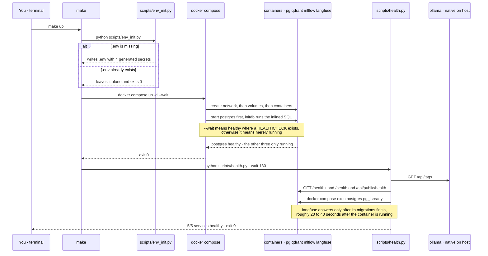

# Phase 0.1 — Platform foundation: the stack comes up, and proves it

> **What this phase adds, in plain terms.** Nothing intelligent yet. This phase builds the *room*
> the rest of the project works in: five background services (a model server, a vector database, a
> relational database, an experiment tracker, a trace viewer), one command that starts them, and —
> the part that actually matters — one command that **refuses to lie about whether they are ready**.
> The exit criterion for this phase is not "the code runs". It is `5/5 services healthy` printed by
> a script that genuinely checked, plus `make down` leaving nothing behind.

**Phase brief:** [PROJECT_BRIEF.md](../PROJECT_BRIEF.md) §9, Phase 0.1.
**Exit criterion:** `make up` → all 5 services healthy · `make down` leaves no orphans.
**Status: met.** Evidence is in [§7](#7-what-was-actually-run).

---

## 1. Honesty up front

Per [DOCS_STANDARDS.md](DOCS_STANDARDS.md) §4, everything below is labelled.

| Part | Tier | Why that tier, honestly |
|---|---|---|
| `scripts/health.py` readiness gate | **Tier 1 — load-bearing** | It does the whole job it claims: real protocol-level checks, retry with deadline, non-zero exit on failure. Nothing about it is simplified. |
| `scripts/check_docs.py` | **Tier 1 — load-bearing** | Fully implements the rules it enforces, and is self-tested. |
| Docker Compose stack | **Tier 2 — demonstrative** | Real services, real versions, real persistence. But single-node, no TLS, no auth on Qdrant or MLflow, one Postgres superuser, secrets in a plaintext `.env`. Correct for local development, **not** a deployment. |
| Secret generation (`env_init.py`) | **Tier 2 — demonstrative** | Uses `secrets` correctly with adequate entropy, and never overwrites. But secrets sit in a gitignored plaintext file — there is no vault, no rotation, no per-environment separation. |
| Ollama as "the model server" | **Tier 2 — demonstrative** | It is genuinely running and genuinely GPU-backed. But it is a single local process with no routing, no failover and no spend accounting — those are Phases 0.2 to 0.4. |
| "Azure-shaped" claim | **Tier 3 — showcase** | The *substitution mapping* is designed and written down. Zero lines have been tested against real Azure. This is stated in the brief and restated here so it cannot drift into sounding like Tier 1. |
| Kubernetes / scale | **not built** | Phase 8. Nothing in this repo runs on a cluster today. |

---

## 2. The end-to-end flow

What actually happens when you type `make up`.



**The load-bearing idea in that diagram:** Compose returns success while Langfuse is still migrating
its database. If `make up` stopped at Compose, it would report a working stack that is not working.
The second arrow — the host-side health script — is the difference between *started* and *ready*.

---

## 3. Function-by-function flow, with dummy inputs and outputs

Real `file::function` names, with a concrete value at each hop.

### 3.1 `scripts/env_init.py` — module level

```python
if ENV.exists():
    print(f".env already exists, leaving it alone ({ENV})")
    raise SystemExit(0)
```

**"If there is already a `.env`, do nothing at all and succeed — never clobber the user's secrets."**

```
# in : .env absent
# out: .env written, stdout "wrote H:\...\LLM_Retail_Platform\.env", exit 0
#      POSTGRES_PASSWORD=jK2f-9xQ...    (32 url-safe chars from secrets.token_urlsafe(24))
#      LANGFUSE_ENCRYPTION_KEY=4f9a...  (64 hex chars, required by Langfuse v2)

# in : .env present
# out: stdout ".env already exists, leaving it alone", exit 0, file untouched
```

Idempotency is the whole point: `make up` depends on `env`, so this runs on *every* start. A version
that regenerated secrets each time would silently orphan the Postgres volume — the database would
still hold the old password while `.env` held a new one.

### 3.2 `scripts/health.py::http(url)` — a check factory

```python
def http(url: str) -> Callable[[], str | None]:
    def check() -> str | None:
        ...
    return check
```

**"Build a small function that knows how to test one URL, and hand it back to be called later."**

Returning `None` for success is deliberate: `None` means "no error to report", so the caller reads as
`if err is None`. The alternative — returning `True` or `False` — throws away the reason.

```
# in : http("http://localhost:6333/healthz") then calling it, qdrant up
# out: None

# in : http("http://localhost:3000/api/public/health") then calling it, langfuse still migrating
# out: "URLError"          (connection refused - the port is not listening yet)

# in : same, langfuse up but broken
# out: "HTTP 503"
```

### 3.3 `scripts/health.py::pg_ready()`

Postgres speaks its own wire protocol, not HTTP, so this shells into the container and asks Postgres
itself.

```python
p = subprocess.run(
    ["docker", "compose", "exec", "-T", "postgres", "pg_isready", "-U", "atelier", "-d", "atelier"],
    capture_output=True, text=True, cwd=ROOT,
)
```

**"Ask Postgres, from inside its own container, whether it is accepting connections for our database."**

```
# in : ()   postgres accepting connections
# out: None

# in : ()   container up, database still starting
# out: "localhost:5432 - rejecting connections"

# in : ()   docker daemon not running
# out: "error during connect: ... The system cannot find the file specified."
```

A plain TCP connect to port 5432 would be the lazier check and would be **wrong**: Postgres binds the
port before it finishes recovery, so a TCP-open test reports ready while queries still fail.

`cwd=ROOT` is not decoration. `docker compose` locates its project by searching upward from the
current directory, so without it the check passes when run via `make` from the repo root and fails
with a confusing "no configuration file provided" from anywhere else.

### 3.4 `scripts/health.py::main()` — the retry loop

```python
while True:
    still = []
    for name, where, check in pending:
        err = check()
        ...
    pending = still
    if not pending or time.monotonic() >= deadline:
        break
```

**"Check everything still outstanding, drop whatever passed, and go round again until either nothing
is left or the deadline expires."**

Services already healthy are never re-checked, so the loop shrinks and the output stops repeating.
`time.monotonic()` rather than `time.time()` because a clock adjustment mid-wait must not move the
deadline.

```
# in : --wait 180, everything up except langfuse
# out: stdout
#        ok    ollama    host :11434
#        ok    qdrant    docker :6333
#        ok    postgres  docker :5433
#        ok    mlflow    docker :5000
#        ...   waiting on langfuse
#        ...   waiting on langfuse
#        ok    langfuse  docker :3000
#        5/5 services healthy
#      exit 0

# in : --wait 0, docker desktop not started
# out: "1/5 services healthy" with four FAIL lines, exit 1   <- make up fails loudly
```

The non-zero exit is what makes this a **gate** rather than a report. `make` stops on it.

### 3.5 `scripts/health.py::self_test()`

The gate is the phase. A gate that cannot fail is decoration, so `run()` takes its service list as an
argument and the self-test hands it stubs — no Docker required.

```
# in : python scripts/health.py --self-test
# out: asserts all four behaviours, then
#      "self-test ok: gate passes when healthy, fails when not, retries, and gives up", exit 0
```

It asserts that a healthy set exits 0, that **one** failure exits 1, that a service which is not
ready at first is retried until it is, and that the loop gives up at the deadline instead of hanging.

**It earned its place immediately:** on its first run it exposed a live bug — the summary line read
`5/5 services healthy` while checking two stub services, because it was counting the module-level
`SERVICES` list rather than the one actually passed in. The exit code was right, so `make up` would
have behaved correctly and the *number printed to a human* would have been wrong. Nothing but a test
that calls the function with a different list would have found that.

### 3.6 `scripts/check_docs.py::mermaid_blocks(lines)`

**"Walk the file once and hand back just the diagram sections, along with the line numbers they
started on, so any problem can be reported at the right line."**

```
# in : ["intro", "```mermaid", "sequenceDiagram", "  A->>B: hi", "```", "outro"]
# out: yields (2, [(3, "sequenceDiagram"), (4, "  A->>B: hi")])
```

### 3.7 `scripts/check_docs.py::check_mermaid(path, lines)`

```
# in : a block containing "  participant A as AI (FastAPI)"
# out: [(path, 3, "mermaid: parentheses in participant alias - use '·'")]

# in : a block containing "  A->>B: hello; world"
# out: [(path, 4, "mermaid: ';' is a statement separator - remove it")]

# in : a block containing "  B->>C: line one <br/> line two"
# out: []          <- br is the one legal tag
```

### 3.8 `scripts/check_docs.py::self_test()`

```
# in : python scripts/check_docs.py --self-test
# out: "self-test ok: 5 rules fire, clean input passes", exit 0
```

It feeds a deliberately broken diagram in and asserts each rule fires, then feeds a clean one in and
asserts silence. **A linter with no failing example is a linter nobody has proven works** — and this
one did in fact catch a bug in its own first version, where the `<br/>` exemption was asserted
wrongly.

---

## 4. File by file

| File | What it does | Why it exists |
|---|---|---|
| [`docker-compose.yml`](../docker-compose.yml) | Declares postgres, qdrant, langfuse, mlflow — images pinned, named volumes, one healthcheck, one inlined init SQL | One file describes the whole runtime, so a new machine is one command away rather than a wiki page |
| [`Makefile`](../Makefile) | `env` `up` `down` `ps` `logs` `health` `clean` | The brief's exit criteria are written as `make` targets, and CI speaks make. Recipes are single shell-agnostic commands so the same file works under `cmd.exe` and `sh` |
| [`scripts/env_init.py`](../scripts/env_init.py) | Generates `.env` once, with real entropy | Hand-written secrets get committed. Generated ones in a gitignored file do not |
| [`scripts/health.py`](../scripts/health.py) | **The phase gate.** Checks all five services, retries to a deadline, exits non-zero on failure | Compose's idea of "up" is not readiness. This is |
| [`scripts/check_docs.py`](../scripts/check_docs.py) | Enforces the DOCS_STANDARDS formatting rules mechanically | The standard says those mermaid pitfalls break rendering *repeatedly*. Repeated human error is a job for a script |
| [`pyproject.toml`](../pyproject.toml) | Package metadata, ruff, mypy strict, dev deps | `dependencies = []` deliberately: runtime deps get added by the phase that needs them, never in advance |
| [`atelier/`](../atelier) | Empty `__init__.py` per layer of §4.2 | The layer boundaries exist as directories before any code, so Phase 0.6's import-linter rule has something to police |
| [`.gitattributes`](../.gitattributes) | `* text=auto eol=lf` | A Makefile checked out with CRLF line endings does not run. On Windows this is a real failure, not hygiene |
| [`docs/decision-log.md`](decision-log.md) | Entries 9 to 13 | Decisions recorded *as made*, each with its cost and its upgrade trigger |
| [`CLAUDE.md`](../CLAUDE.md) | The docs standard, restated as binding working rules | — |

Both `scripts/health.py` and `scripts/env_init.py` are **standard library only**, on purpose:
`make up` must work on a clean checkout with no virtualenv and nothing installed.

---

## 5. ⚠️ Scaffolded — be ready to explain

Things present in this phase that are not yet fully mastered or fully justified. Named here so they
are never mistaken for settled work.

- **`--wait` does not mean what it looks like.** Verified by inspection: only `postgres` declares a
  `HEALTHCHECK`. For qdrant, mlflow and langfuse, Compose prints `Healthy` when the container is
  merely *running*. Be ready to explain the difference between a container being running, being live,
  and being ready — and to say why the readiness gate was put in a host-side script rather than in
  more Compose healthchecks. (Short answer: the Qdrant image ships without `curl` or `wget`, so an
  in-container HTTP healthcheck needs contortions, while the host script needs none — and the host is
  where the client actually lives.)
- **Compose `configs:` with inline `content:`** is what creates the `langfuse` database. This is a
  relatively new Compose feature. Know the alternatives — a bind-mounted `.sql` file, which was
  rejected because the repo lives on a syncing Google Drive path, or a custom Postgres image.
- **Langfuse v2, not v3.** v3 splits into web, worker, ClickHouse, Redis and MinIO. Be ready to
  explain *why* v3 needs an OLAP store and a queue — high-cardinality trace analytics — and to state
  the trigger at which v2's Postgres-backed ingest becomes this project's bottleneck.
- **One Postgres role, and it is the owner.** No least privilege, no separate application role.
  Phase 6 needs row-level security, which is close to meaningless if the app connects as the owner,
  so this must change there. It is a known gap, not an oversight.
- **No authentication on Qdrant or MLflow**, and no TLS anywhere. Every published port is therefore
  bound explicitly to `127.0.0.1` rather than to `0.0.0.0`, so nothing is reachable from the local
  network. Publishing as `"5432:5432"` would listen on every interface — which on a shared or public
  network means an unauthenticated Qdrant and MLflow to anyone on it. Be ready to explain that the
  short form of `ports:` defaults to all interfaces, and that this is the single most common way a
  development stack ends up exposed.
- **The `langfuse` database is created only on the *first* initialisation of the `pgdata` volume.**
  Postgres runs `/docker-entrypoint-initdb.d/*` exactly once, when the data directory is empty. If
  the inlined SQL is ever changed, an existing volume will not pick it up and Langfuse will fail to
  connect for reasons that look nothing like the cause — the fix is `make clean`, which destroys
  data. Know this before editing that block.
- **GPU headroom is 6 GB (RTX 2060).** No model has been pulled yet. Whether a 7B generator, an
  embedding model and Llama Guard 3 can be resident together is an open question that lands in
  Phase 4, not an answered one.
- **`make` was installed to satisfy the brief's own vocabulary.** Be ready to defend that against the
  alternative of a pure-Python task runner.

---

## 6. Mini-glossary

| Term | One line |
|---|---|
| **Image** | A read-only filesystem template. `postgres:16-alpine` is an image |
| **Container** | One running instance of an image, with its own writable layer |
| **Named volume** | Docker-managed persistent storage living in the Docker VM rather than in the repo. Survives `down`, dies on `down --volumes` |
| **Bind mount** | Mapping a *host* directory into a container. Deliberately avoided here — the host path is on a syncing drive |
| **Healthcheck** | A command Docker runs *inside* a container to decide whether it is healthy. Only Postgres declares one here |
| **Readiness** | Whether a service can serve requests *now*. Distinct from being running, and the thing this phase actually gates on |
| **`depends_on: service_healthy`** | Start ordering that waits for a healthcheck to pass rather than just for the container to exist |
| **Orphan container** | A container from an earlier version of the Compose file that no longer matches any service. `--remove-orphans` deletes them |
| **Idempotent** | Running it twice gives the same result as running it once. `env_init.py` is |
| **HNSW** | The approximate-nearest-neighbour graph index Qdrant uses. Phase 2 tunes it |
| **Tracking server** | MLflow's backend, which stores experiment runs, parameters and metrics |
| **Trace** | The recorded story of one request — every model call, its tokens, its cost, its latency. Langfuse displays these from Phase 0.5 |
| **OpenAI-compatible endpoint** | An HTTP API shaped like OpenAI's, so the same client library works against it. Ollama exposes one, which is why swapping to Azure OpenAI is a base-URL change |

---

## 7. What was actually run

Per [DOCS_STANDARDS.md](DOCS_STANDARDS.md) §4, stated rather than implied.

**Executed, output observed:**

```
make up                                   -> 5/5 services healthy, warm start 24s
make down                                 -> 0 containers, 0 networks, 3 volumes kept
python scripts/health.py                  -> verified in both pass and fail states
python scripts/health.py --self-test      -> gate proven to pass, fail, retry and give up
python scripts/check_docs.py              -> 12 files checked, 0 problems
python scripts/check_docs.py --self-test  -> 5 rules fire, clean input passes
python -m py_compile scripts/*.py         -> all compile
docker inspect .Config.Healthcheck        -> confirmed only postgres declares one
psql -c "select datname from pg_database" -> confirmed atelier, langfuse, postgres
```

**Not run, and therefore not claimed:**

- Nothing has been tested against real Azure. The substitution table is a design, not a migration.
- No Kubernetes manifest exists yet, so none has been validated.
- No model has been pulled into Ollama, so no inference has happened through any of this.
- The stack has only ever been started on this one Windows machine with Docker Desktop. It has not
  been run on Linux, in CI, or on a second machine.
- `make clean` has not been executed — dropping the volumes was not worth re-pulling images to prove.

---

## 8. Q&A

Real questions from this phase.

**Why is Ollama not in the Compose file with everything else?**
Because the GPU is the point. This box has an RTX 2060, and the native Windows Ollama build uses it
with no configuration. A containerised Ollama on Windows reaches the GPU only through WSL2
passthrough. The cost is honest and logged: this stack is not one-command portable to a fresh Linux
box until an `ollama` service is added there, which is about six lines when it matters.

**Why does `make up` run a health script when `docker compose up --wait` already waits?**
Because they answer different questions. `--wait` answers "did Docker manage to start these
containers", and where no healthcheck is declared it settles for *running*. The health script answers
"can I make a successful request to each of these five things right now" — including Ollama, which
Compose does not manage at all. Langfuse demonstrated the gap on the very first run: Compose reported
success while Langfuse was still running database migrations and refusing connections for another
half-minute.

**Why keep the volumes on `make down`?**
Because a 20,000-product catalog and a set of embeddings are expensive to rebuild, and stopping the
stack is something you do many times a day. Destroying data is a separate, explicitly named target —
`make clean` — precisely so it cannot happen by reflex.

**`ollama` (or `make`, or `winget`) says "not recognized as the name of a cmdlet", but the directory
is definitely in PATH. Why?**
Because a process receives its environment **as a copy from its parent, taken at launch**. Editing
PATH updates the registry and notifies running apps, but a terminal spawned by an `explorer.exe` that
started *before* the edit inherits Explorer's stale copy — and so does every "new window" opened from
that same Explorer. Opening another window does not help, because the stale parent is what is being
copied from. **Sign out and back in, or reboot.** Until then, the full path works:
`& "$env:LOCALAPPDATA\Programs\Ollama\ollama.exe" pull ...`

This bit three separate tools in this phase — `make` and `winget` immediately after installation, and
`ollama`, which had been installed long before but had never had a fresh login since.

**How do you tell a stale environment apart from a truncated PATH?**
They look identical from the prompt and have different fixes, so check rather than guess. Compare the
stored value against the live one:

```powershell
$stored = ([Environment]::GetEnvironmentVariable('Path','User') -split ';') | Where-Object {$_}
$live   = ($env:Path -split ';') | Where-Object {$_}
$stored | Where-Object { $live -notcontains $_ }
```

If the live PATH is a **prefix** of the stored one — everything up to some point, nothing after — it
is length truncation, and the fix is to shorten PATH or move the entry earlier. If entries are
missing from the **middle**, or the last stored entries are present, it is not truncation and the
environment is simply stale.

One genuinely missing entry was found this way on this machine: the user PATH contained
`C:\WINDOWS\system32\config\systemprofile\AppData\Local\Microsoft\WindowsApps` — the **SYSTEM
account's** directory — in place of the real `%LOCALAPPDATA%\Microsoft\WindowsApps`, which is why
`winget` could not be found by name at all. That is the fingerprint of a `setx` run from an elevated
or SYSTEM context. The same user PATH also held a complete second copy of the machine PATH in two
different casings, 35 duplicate entries in total. Neither is fatal, and neither was caused by this
project — worth recognising, not worth fixing mid-phase.

**Never repair PATH with `setx PATH "%PATH%;..."`.** It truncates at 1024 characters and merges the
user and machine values into one, which silently destroys entries. Use the Environment Variables GUI,
or `[Environment]::SetEnvironmentVariable('Path', $value, 'User')`, and back the old value up first.

**Was the exit criterion actually met, or does it just look met?**
Met, and measured in both directions. `5/5 services healthy` came from a script that makes real
requests and exits non-zero when they fail — and it *was* observed failing, reporting `1/5`, before
Docker Desktop was started. `make down` was followed by a container, network and volume count rather
than by an assumption.
